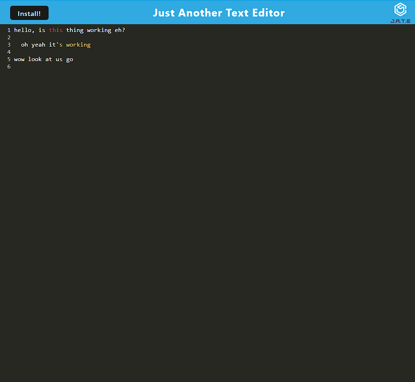

# CodePad Text Editor

## Description
A notepad app for Web Developers. Saves what you've written to your browser storage and utilizes Express Service Worker to save data even when offline. As a Progresive Web App, it is fully downloadable so you can use it outside the browser.

## Installation

Just visit the app [here](https://evening-everglades-03167.herokuapp.com) Don't forget to install to your desktop to work offline!

## Usage
Write some notes, code, whatever - it will automatically save whatever you've written so it will persist the next time you launch the app. Click install to download the app to your desktop and use it outside the browser

